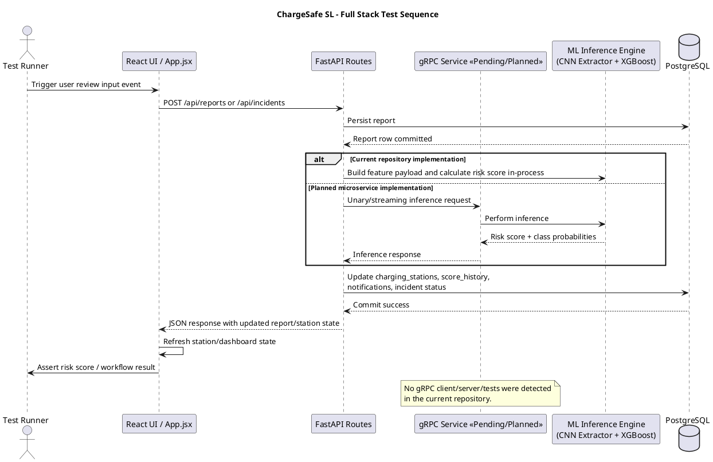
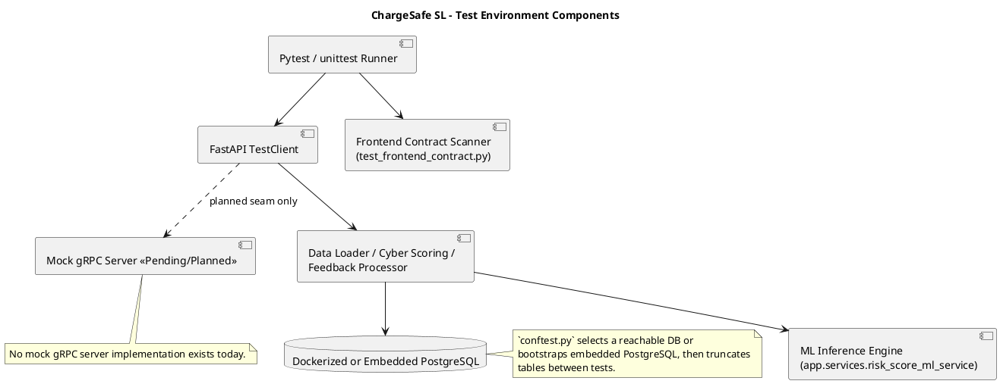
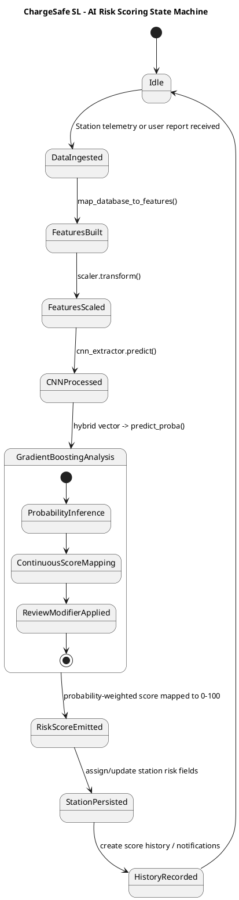

# ChargeSafe SL: Professional Testing Infrastructure & Discovery Manifest

## 1. Audit Scope

### Repository Scan Verdict

| Item | Discovery |
| --- | --- |
| Primary backend test framework | `pytest` with `fastapi.testclient.TestClient`, plus several `unittest.TestCase` suites |
| Test module footprint | `21` Python test modules under `backend/tests` |
| Named test footprint | `92` named test functions/methods discovered via source scan |
| Database strategy in tests | Real PostgreSQL if reachable, otherwise embedded local PostgreSQL bootstrap; DB is truncated between tests |
| Frontend-native unit tests | Not implemented |
| Browser automation E2E | Not implemented |
| gRPC tests | Not implemented |
| Performance/load tests | Not implemented |
| AI model verification | Partial pipeline and training-behavior coverage; no direct golden-output or accuracy-regression tests for the shipped model artifacts |

### Audit Method

- Static repository inspection across `backend/tests`, `backend/app`, `frontend`, `docker-compose.yml`, `backend/requirements.txt`, and related service files.
- Pytest collection was attempted, but the local environment was not documentation-grade:
  - Global Python lacked `httpx` required by `starlette.testclient`.
  - The checked-in `.venv` could not launch cleanly because its interpreter path was stale.
- This manifest therefore represents a source-verified coverage inventory, not a confirmed green execution report.

## 2. Test Runtime Topology

### 2.1 Core Test Infrastructure

| Capability | Evidence | Implementation Notes |
| --- | --- | --- |
| Base environment setup | `backend/tests/conftest.py:18-27` | Forces `APP_ENV=test`, seeds admin password, blanks SMTP/Google API values for deterministic execution. |
| Database auto-selection | `backend/tests/conftest.py:111-131` | Chooses `CHARGESAFE_TEST_DATABASE_URL`, `TEST_DATABASE_URL`, or `DATABASE_URL` if reachable; otherwise starts embedded PostgreSQL. |
| Embedded PostgreSQL fallback | `backend/tests/conftest.py:58-108` | Uses `initdb` and `pg_ctl`; creates isolated test DB and stops it at process exit. |
| DB cleanup | `backend/tests/conftest.py:181-205` | Truncates core tables including `users`, `charging_stations`, `incident_reports`, `user_sessions`, `audit_logs`. |
| HTTP client | `backend/tests/conftest.py:296-299` | All route/system tests use FastAPI `TestClient`. |
| Deterministic feedback pipeline | `backend/tests/conftest.py:226-264` | Autouse monkeypatch replaces `FeedbackProcessor.process_feedback` with predictable score movement logic and history/notification side effects. |
| Deterministic audit context | `backend/tests/conftest.py:267-293` | Forces stable request IP/user-agent for audit assertions. |
| Test data factories | `backend/tests/factories.py:36-254` | Factories create users, stations, reports, notifications, messages, score histories, cyber criteria, auth sessions, and live TOTP codes. |

### 2.2 Supporting Factory/Fixture Assets

| Asset | Code Reference | Purpose |
| --- | --- | --- |
| `create_user` | `backend/tests/factories.py:36` | Persists users with optional MFA, roles, settings, verified/inactive states. |
| `create_station` | `backend/tests/factories.py:80` | Seeds telemetry-bearing stations with risk score, city, power, connector, temperature, and fault count. |
| `create_report` | `backend/tests/factories.py:158` | Seeds incident or positive feedback records with typed statuses. |
| `create_authenticated_session` | `backend/tests/factories.py:239` | Generates real JWT access/refresh tokens through `SessionService`. |
| `current_totp` | `backend/tests/factories.py:254` | Produces valid MFA code for seeded secrets. |
| `login_with_mfa` | `backend/tests/conftest.py:389` | Exercises login plus MFA verification, returning live tokens for route tests. |

## 3. Requested Testing Layers Mapped to the Repository

### 3.1 Unit Testing (Component Level)

| Requested Area | Status | Evidence | Notes |
| --- | --- | --- | --- |
| Backend route/API tests | Implemented | `backend/tests/api/*.py`, plus security/utility suites in `backend/tests/*.py` | Most route tests are request-level component tests against `TestClient` and the test DB. |
| Utility/service logic tests | Implemented | `test_account_lockout.py`, `test_session_service.py`, `test_mfa_service.py`, `test_feedback_and_risk_notifications.py`, `test_bootstrap_and_services.py`, `test_gemini_and_middleware.py` | Covers lockout, sessions, MFA, feedback normalization, data loader logic, middleware, and service helpers. |
| Pydantic schema validation tests | Implemented | `test_input_validation_security.py`, `test_feedback_and_risk_notifications.py` | Verifies MFA code patterns, UUID coercion, report severity logic, alias normalization. |
| Frontend Jest/RTL suites | Pending/Planned | No `jest`, `vitest`, `@testing-library/*`, or test script in `frontend/package.json` | Current frontend coverage is indirect via backend-side contract inspection of `frontend/src/App.jsx`. |
| Frontend state-management assertions | Pending/Planned | No Redux or Context test suites detected | Frontend appears to use local React state in `frontend/src/App.jsx`, not Redux/Context-based tested stores. |
| AI logic unit tests for direct model outputs | Partial | `test_bootstrap_and_services.py` covers feature engineering and incremental update behavior | No test asserts an actual CNN/XGBoost inference score against fixed model artifacts. |

### 3.2 Integration Testing (Subsystem Interaction)

| Requested Area | Status | Evidence | Notes |
| --- | --- | --- | --- |
| FastAPI + PostgreSQL | Implemented | `backend/tests/conftest.py`, `backend/tests/integration/test_report_and_admin_workflows.py`, many API/system suites | Uses a real SQLAlchemy session against a live/embedded PostgreSQL DB with truncation isolation. |
| Transaction rollback-style tests | Partial | DB reset is table truncation, not per-test transaction rollback | No explicit nested transaction or rollback fixture was found. |
| Service layer with DB side effects | Implemented | `test_bootstrap_and_services.py`, `test_report_and_admin_workflows.py` | Validates score history, notifications, station updates, admin CRUD, sync stats. |
| ML pipeline integration | Partial | `backend/app/services/data_loader_service.py:152`, `backend/app/services/risk_score_ml_service.py:25`, `test_bootstrap_and_services.py:112, 310, 328` | Feature map and incremental booster refresh are tested; direct end-to-end artifact inference remains unverified. |
| gRPC unary/streaming service tests | Pending/Planned | No `grpc`, `.proto`, client, or server assets detected | Requested microservice/gRPC topology is not implemented in this repo. |

### 3.3 End-to-End and System Testing

| Requested Area | Status | Evidence | Notes |
| --- | --- | --- | --- |
| API-level user journeys | Implemented | `backend/tests/e2e/test_user_journeys.py` | Covers registration, MFA completion, protected access, logout, incident submission, settings/profile, admin reads. |
| System/API flow tests | Implemented | `backend/tests/system/*.py` | Covers health/ready boot, RBAC, deactivation, password/session behavior, deletion, validation edges, sync/chat service endpoints. |
| Browser-level full UI automation | Pending/Planned | No Playwright/Cypress/Selenium | No DOM-driving tests simulate clicks or dashboard repaint from a real browser session. |
| Frontend-to-dashboard live risk update verification | Partial | API workflows update station/report state; `test_frontend_contract.py` checks strings/endpoints only | No browser assertion confirms the dashboard visually refreshes after backend risk score changes. |

### 3.4 Security and Cyber-Risk Testing

| Requested Area | Status | Evidence | Notes |
| --- | --- | --- | --- |
| Input sanitization/validation | Implemented | `test_input_validation_security.py`, `test_report_and_admin_api.py`, schema validators in `backend/app/schemas.py` | Rejects malformed MFA codes, UUID injection payloads, weak passwords, invalid report payloads, invalid settings/message values. |
| JWT auth/session flow | Implemented | `test_auth_api.py`, `test_auth_edge_cases_api.py`, `test_session_service.py`, `test_api_security_hardening.py` | Covers login, MFA, refresh rotation, logout rejection, inactive users, session revocation, access/refresh token binding. |
| OAuth2 federated flow | Pending/Planned | No OAuth provider flow detected | Current implementation is JWT + MFA, not OAuth2 federation. |
| CSRF/HTTPS/security headers | Implemented | `test_gemini_and_middleware.py` | Explicit middleware tests for origin checks, token checks, secure cookie/header behavior, redirect enforcement. |
| RBAC hardening | Implemented | `test_api_security_hardening.py`, admin/system tests | Confirms public/protected route design and admin-only access control. |
| EV-specific cyber posture scoring | Implemented | `test_station_api.py`, `test_bootstrap_and_services.py` | Cyber criteria weighting and risk-band calculations are exercised. |
| Spoofing / MITM simulation | Pending/Planned | No network adversary simulation harness found | HTTPS redirect and secure headers exist, but no true spoofing or man-in-the-middle scenario tests were found. |

### 3.5 Performance and Load Testing

| Requested Area | Status | Evidence | Notes |
| --- | --- | --- | --- |
| Locust | Pending/Planned | No Locust files/configs detected | Not implemented. |
| JMeter | Pending/Planned | No JMeter assets detected | Not implemented. |
| Custom latency/load harness | Pending/Planned | No concurrency benchmark scripts detected | No performance assertions for risk-scoring throughput or API saturation. |

## 4. ML and AI Architecture Reality Check

### 4.1 What the Repository Actually Implements

| Topic | Evidence | Discovery |
| --- | --- | --- |
| Shipped inference engine | `backend/app/services/risk_score_ml_service.py:25-188` | Hybrid risk scoring service using a Keras CNN feature extractor plus XGBoost or gradient-boosting artifact. |
| Artifact set | `backend/models/cnn_extractor.keras`, `backend/models/xgb_risk_classifier.json`, `backend/models/scaler.pkl`, `backend/models/feature_names.json`, `backend/models/le_dict.pkl`, `backend/models/label_encoder.pkl` | Production artifacts are present in-repo. |
| Feature engineering | `backend/app/services/data_loader_service.py:152-197` | Builds a mixed payload from station telemetry, report severity, review counts, keyword counts, and feedback-signal heuristics. |
| Inference composition | `backend/app/services/risk_score_ml_service.py:94-109` | Scales tabular features, extracts CNN features, concatenates into a hybrid vector, then uses class probabilities to derive a continuous 0-100 score. |
| Incremental training behavior | `backend/app/services/training_service.py:9-95` | Online/minibatch booster update logic exists in the active `app.services` layer. |

### 4.2 What Was Requested but Not Found

| Requested Claim | Repo Finding |
| --- | --- |
| ResNet34 model test suite | No explicit `ResNet34` implementation or test references were found. |
| Direct per-model output validation for CNN and booster | No test locks a known input to an expected inference probability/score. |
| Dynamic inference pipeline test proving vector handoff numerically | Partial only; feature preparation and booster update path are exercised, but not a full artifact-backed golden prediction. |
| gRPC-mediated ML microservice | Not present. The ML engine is invoked in-process, not through gRPC. |

## 5. Detailed Test Module Manifest

### 5.1 `backend/tests/test_account_lockout.py`

Layer: Unit, security utility, authentication hardening.

| Test ID/Name | Objective | Pre-conditions | Input Data | Expected Outcome | Code Reference |
| --- | --- | --- | --- | --- | --- |
| `test_fifth_failed_attempt_locks_for_thirty_minutes_and_triggers_notification` | Verify the fifth failed login attempt activates lockout and emits notification metadata. | User namespace seeded with `failed_login_attempts=4`; mock notifier; UTC timestamp. | User email plus current time passed into `register_failed_login_attempt`. | Returns locked state; attempts become `5`; `locked_until == now + ACCOUNT_LOCKOUT_DURATION`; notifier called once. | `backend/tests/test_account_lockout.py:26` |
| `test_active_lockout_blocks_access` | Verify lockout predicate denies access while `locked_until` is in the future. | User namespace with future lock timestamp. | `locked_until = now + 10 minutes`. | `is_account_locked(...)` returns `True`. | `backend/tests/test_account_lockout.py:40` |
| `test_expired_lockout_auto_unlocks` | Ensure expired lockouts reset counters and clear the lock. | User namespace with `failed_login_attempts=5` and expired `locked_until`. | `locked_until = now - 1 second`. | `clear_expired_lockout(...)` returns `True`; attempts reset to `0`; `locked_until=None`. | `backend/tests/test_account_lockout.py:46` |
| `test_reset_lockout_state_clears_attempts_and_lock` | Verify manual reset removes all lockout state. | User namespace with attempts and future lock. | `failed_login_attempts=3`. | Attempts reset to `0`; lock cleared. | `backend/tests/test_account_lockout.py:59` |

### 5.2 `backend/tests/test_api_security_hardening.py`

Layer: Security design validation, route dependency audit, unauthorized access behavior.

| Test ID/Name | Objective | Pre-conditions | Input Data | Expected Outcome | Code Reference |
| --- | --- | --- | --- | --- | --- |
| `test_public_routes_remain_unauthenticated_by_design` | Confirm selected public endpoints do not depend on auth injectors. | App startup/shutdown hooks suppressed; `get_db` overridden with dummy session. | Public route list including `/api/health`, `/api/auth/login`, `/api/stations/{station_id}`. | No `get_current_user` or `get_current_admin` dependency found on audited routes. | `backend/tests/test_api_security_hardening.py:54` |
| `test_protected_routes_require_auth_by_design` | Confirm protected endpoints explicitly require user or admin dependency. | Same route inspection harness. | Protected route list including `/api/chat`, `/api/sync-openchargemap`, `/api/me`, `/api/stations/{station_id}/cyber-score`. | Each route contains the required auth dependency in its dependency graph. | `backend/tests/test_api_security_hardening.py:73` |
| `test_protected_routes_return_401_without_token` | Verify unauthenticated requests fail at runtime. | `TestClient` bound to app with dummy DB. | POST/GET calls to protected routes without `Authorization` header. | All requests return HTTP `401`. | `backend/tests/test_api_security_hardening.py:90` |

### 5.3 `backend/tests/test_audit_logging.py`

Layer: Unit, audit integration helper.

| Test ID/Name | Objective | Pre-conditions | Input Data | Expected Outcome | Code Reference |
| --- | --- | --- | --- | --- | --- |
| `test_write_audit_log_uses_audit_service` | Ensure route helper forwards normalized context to `AuditService.log_event_safely`. | Mock request with `client.host` and `user-agent`; patched audit service. | Action `login`, result `success`, UUID `user_id`, `details={"source":"test"}`. | Audit service called once with action/result plus derived IP and user-agent. | `backend/tests/test_audit_logging.py:10` |

### 5.4 `backend/tests/test_bootstrap_and_services.py`

Layer: Unit + service integration + ML pipeline support.

| Test ID/Name | Objective | Pre-conditions | Input Data | Expected Outcome | Code Reference |
| --- | --- | --- | --- | --- | --- |
| `test_seed_initial_data_creates_demo_stations_history_and_admin` | Validate bootstrap seeding of stations, histories, and admin account. | `ADMIN_PASSWORD` set; empty DB session. | Call `seed_initial_data(db_session)`. | Seed stations count equals `SEED_STATIONS`; admin user exists with `admin@chargesafe.app`; four score-history and temperature rows per station. | `backend/tests/test_bootstrap_and_services.py:25` |
| `test_seed_initial_data_removes_stale_station_and_updates_legacy_admin_email` | Verify cleanup of retired demo stations and admin email migration. | Stale station using `REMOVED_STATION_NAMES`; legacy admin `admin@chargesafe.local`. | Call `seed_initial_data`. | Stale station deleted; admin email updated to `admin@chargesafe.app`. | `backend/tests/test_bootstrap_and_services.py:42` |
| `test_seed_initial_data_requires_admin_password_for_missing_admin` | Ensure bootstrap fails when admin creation would be unsafe. | `ADMIN_PASSWORD` removed from env. | Call `seed_initial_data`. | Raises `RuntimeError`. | `backend/tests/test_bootstrap_and_services.py:68` |
| `test_data_loader_feedback_analysis_and_station_summary` | Validate text sentiment heuristics and aggregate station review summary. | Seeded station, user, one negative report, one positive report. | Negative text: overheating/offline/sparks; positive text: working fine/charging successfully. | Negative signal labeled `negative`; positive labeled `positive`; summary has `review_count=2`, `bad_review_ratio=0.5`; newest report is the positive review. | `backend/tests/test_bootstrap_and_services.py:75` |
| `test_map_database_to_features_builds_ml_payload` | Verify DB objects are transformed into the hybrid ML feature payload. | Station with high power and CCS2; report with severe overheating text. | `charging_power_kw=120`, operator `ChargeSafe`, connector `CCS2`, severity `4`. | Payload contains `max_charge_power=120`, `RapidCharge=1`, `FastCharge=1`, `Manufacturer=ChargeSafe`, `PlugType=CCS2`, review counters, `feedback_signal_label=negative`. | `backend/tests/test_bootstrap_and_services.py:112` |
| `test_fetch_openchargemap_normalizes_results_and_skips_missing_coordinates` | Validate external station normalization and malformed-record filtering. | `requests.get` monkeypatched to return one valid OCM station and one missing coordinates. | Payload with connections `CCS2` and `Type 2`, plus a broken record. | Only the valid station survives; connector types collapse to `"CCS2, Type 2"`; max power becomes `50`; status normalized to `operational`. | `backend/tests/test_bootstrap_and_services.py:138` |
| `test_fetch_openchargemap_rejects_placeholder_key` | Ensure sync refuses placeholder API credentials. | `OPENCHARGEMAP_API_KEY` monkeypatched to placeholder token. | Call `fetch_openchargemap_for_sri_lanka()`. | Raises `RuntimeError`. | `backend/tests/test_bootstrap_and_services.py:179` |
| `test_upsert_apply_payload_and_sync_openchargemap` | Validate create/update station sync, risk score application, payload enrichment, and sync statistics. | Empty DB; sync fetch and ML scorer monkeypatched. | One create payload then update payload; scorer returns `67.5`; sync fetch returns two stations. | First `_upsert_station` creates, second updates; `_apply_risk_score(88.0)` yields `HIGH`; payload color becomes red; sync stats report fetched/created/updated/scored stations and no failures. | `backend/tests/test_bootstrap_and_services.py:186` |
| `test_sync_openchargemap_handles_station_failure_and_global_failure` | Verify per-station failure accounting and full-sync error reporting. | Fetch monkeypatched first to valid-shaped bad station, later to raise network error; `_upsert_station` patched to explode. | Failure message `"boom"` then `"network down"`. | First sync increments `failed=1` and returns empty station list; second sync returns `error="network down"`. | `backend/tests/test_bootstrap_and_services.py:235` |
| `test_cyber_scoring_service_scores_station_and_all_stations` | Validate cyber criterion scoring logic, notes, risk ratings, row creation, and aggregate scoring stats. | Station seeded as faulty/high-risk/hot/unstable; four cyber criteria inserted. | `risk_score=88`, `fault_count=5`, `temperature=52`, `firmware_age_days=365`. | Base score is `4`; criterion notes mention firmware age and temperature; station scoring creates four `CyberScore` rows; station cyber level becomes `high`; global scoring stats show at least one scored station. | `backend/tests/test_bootstrap_and_services.py:260` |
| `test_cyber_scoring_returns_zero_when_no_criteria_exist` | Ensure cyber scoring no-ops cleanly without configured criteria. | Station exists; no `CyberCriterion` rows. | Call `score_station`. | Returns `0`. | `backend/tests/test_bootstrap_and_services.py:304` |
| `test_training_service_noops_without_ml_and_with_empty_reviews` | Validate safe no-op behavior when ML stack is unavailable, scorer is uninitialized, or review buffer is empty. | ML availability/scorer state monkeypatched through three scenarios. | `station_id="station-1"`; empty recent-review list. | Method returns without raising and without updating artifacts. | `backend/tests/test_bootstrap_and_services.py:310` |
| `test_training_service_updates_booster_when_recent_reviews_exist` | Verify the incremental booster update path runs and persists model artifacts when reviews exist. | Fake scaler, CNN extractor, label encoder, booster, xgb wrapper, DB query chain, and `xgboost.DMatrix` monkeypatched. | One fake report with `severity=4`; one fake station; feature payload `{"score_feature": 4}`. | Booster `update(...)` invoked; model save path ends with `xgb_risk_classifier.json`. | `backend/tests/test_bootstrap_and_services.py:328` |

### 5.5 `backend/tests/test_cors_config.py`

Layer: Unit, configuration parsing.

| Test ID/Name | Objective | Pre-conditions | Input Data | Expected Outcome | Code Reference |
| --- | --- | --- | --- | --- | --- |
| `test_cors_lists_are_parsed_and_frontend_origin_is_preserved` | Verify comma-delimited env values are parsed into normalized settings lists. | Constructed `Settings(...)` instance. | Origins `http://localhost:5173,https://app.example.com`; methods `GET,POST,OPTIONS`; headers `Authorization,Content-Type`. | Parsed lists retain both origins and exact allowed methods/headers. | `backend/tests/test_cors_config.py:7` |

### 5.6 `backend/tests/test_feedback_and_risk_notifications.py`

Layer: Unit, schema validation, notification policy.

| Test ID/Name | Objective | Pre-conditions | Input Data | Expected Outcome | Code Reference |
| --- | --- | --- | --- | --- | --- |
| `test_positive_feedback_accepts_missing_severity` | Confirm positive reports may omit severity. | None beyond schema construction. | `ReportCreate(report_type="Positive", severity=None, description="Charging session completed smoothly...")`. | `report_type` normalizes to `IncidentType.positive`; `severity` remains `None`. | `backend/tests/test_feedback_and_risk_notifications.py:72` |
| `test_frontend_category_aliases_are_normalized` | Verify frontend wording aliases map to canonical incident types. | None. | `report_type="Connectivity / Offline"`, severity `4`. | Normalizes to `IncidentType.network_outage`. | `backend/tests/test_feedback_and_risk_notifications.py:83` |
| `test_non_positive_feedback_still_requires_severity` | Ensure non-positive reports reject omitted severity. | None. | `report_type="Overheating"`, `severity=None`. | Schema construction raises validation exception. | `backend/tests/test_feedback_and_risk_notifications.py:93` |
| `test_risk_category_mapping_and_message` | Validate score-band mapping and human-readable notification text builders. | None. | Scores `None`, `25`, `55`, `91`; station name `Station A`. | Bands map to `LOW/MEDIUM/HIGH`; state-change and score-update messages match expected strings. | `backend/tests/test_feedback_and_risk_notifications.py:102` |
| `test_notification_created_only_when_band_changes` | Verify risk-band jump creates notifications only for active users with settings permitting delivery. | Fake station, three fake users with mixed settings, fake session collector. | Old score `22`, new score `81`, fixed timestamp. | Two notifications created, both `Notification` objects, `danger` type, and state-change message text. | `backend/tests/test_feedback_and_risk_notifications.py:116` |
| `test_no_notification_for_initial_or_same_band_updates` | Ensure initial scoring or unchanged score does not emit notifications. | Fake station, one active user, fake session. | Old score `None -> 25`; then `10 -> 10`. | Created count is `0` in both cases; no session additions. | `backend/tests/test_feedback_and_risk_notifications.py:144` |
| `test_same_band_score_change_still_creates_notification` | Verify same-band score movement still produces an update notification. | Fake station/user/session. | Old score `45`, new score `52.5`. | One notification created with title `Risk Score Updated - Galle Station`, `warn` type, and score delta message. | `backend/tests/test_feedback_and_risk_notifications.py:169` |

### 5.7 `backend/tests/test_gemini_and_middleware.py`

Layer: Unit/integration, AI fallback behavior, middleware security.

| Test ID/Name | Objective | Pre-conditions | Input Data | Expected Outcome | Code Reference |
| --- | --- | --- | --- | --- | --- |
| `test_gemini_helpers_and_local_fallbacks` | Validate station matching, risk-band helpers, and local fallback responses. | DB seeded with one high-risk and one low-risk station. | Queries like `"What is Colombo Central Station risk score?"`, `"Which are the safest stations?"`, `"Which stations are highest risk?"`. | Match helpers select correct station; bands map correctly; fallback replies include exact station names and risk summaries. | `backend/tests/test_gemini_and_middleware.py:26` |
| `test_generate_chat_reply_uses_local_fallback_and_live_client` | Verify chat chooses local fallback with no API key, uses live client when configured, and falls back on client failure. | Station seeded; `settings.google_api_key` monkeypatched through blank/fake states; fake Gemini client objects supplied. | Direct station question, generic greeting, live overview request, failure path. | Local direct reply includes `61.0/100`; generic fallback cites highest scored station; live path returns `"live ai reply"`; failure path returns fallback high-risk summary. | `backend/tests/test_gemini_and_middleware.py:55` |
| `test_csrf_helper_functions` | Validate helper predicates for cookies, bearer auth, and allowed origins. | SimpleNamespace request with session cookie, CSRF cookie, bearer token, frontend origin. | Cookie/header payload. | All three helper predicates return `True`. | `backend/tests/test_gemini_and_middleware.py:112` |
| `test_csrf_middleware_enforces_origin_and_token` | Ensure CSRF middleware sets token cookie and blocks bad origin or mismatched token while allowing valid or bearer-auth requests. | Temporary FastAPI app with `CSRFMiddleware`; allowed origin patched to `http://frontend.test`. | Safe GET, invalid-origin POST, invalid-token POST, valid POST, bearer bypass POST. | Safe GET sets CSRF cookie; invalid origin/token return `403`; valid request and bearer-auth bypass return `200`. | `backend/tests/test_gemini_and_middleware.py:123` |
| `test_https_redirect_middleware_and_secure_detection` | Verify HTTPS redirect enforcement and secure-request detection rules. | Temporary FastAPI app with HTTPS middleware; `settings.enforce_https=True`. | Insecure GET plus secure/insecure forwarded-header request objects. | GET receives `307` redirect to `https://...`; `is_request_secure` returns `True/True/False` for HTTPS, forwarded HTTPS, plain HTTP. | `backend/tests/test_gemini_and_middleware.py:177` |
| `test_security_headers_middleware_adds_headers_and_secures_cookies` | Validate production security headers and secure cookie mutation. | Temporary app with `SecurityHeadersMiddleware`; production env and HTTPS enforcement enabled. | GET `/cookie` with `x-forwarded-proto=https`. | Response contains CSP, XFO, nosniff, no-referrer, HSTS; `set-cookie` gains `Secure`, `HttpOnly`, `SameSite=lax`; CSRF cookie helper omits `HttpOnly`. | `backend/tests/test_gemini_and_middleware.py:205` |

### 5.8 `backend/tests/test_input_validation_security.py`

Layer: Unit/security/schema validation.

| Test ID/Name | Objective | Pre-conditions | Input Data | Expected Outcome | Code Reference |
| --- | --- | --- | --- | --- | --- |
| `test_mfa_codes_must_be_six_digits` | Reject malformed MFA codes before route logic runs. | Dummy DB override and `TestClient` bootstrapped. | `MfaEnableRequest(code="12'345")`; `MfaLoginRequest(code="ABC123")`. | Pydantic raises `ValidationError` for both. | `backend/tests/test_input_validation_security.py:38` |
| `test_internal_feedback_request_rejects_non_uuid_injection_payloads` | Ensure UUID schema blocks SQL-style injection strings. | Same schema harness. | `report_id="' OR 1=1 --"` with valid-looking station UUID. | Pydantic raises `ValidationError`. | `backend/tests/test_input_validation_security.py:45` |
| `test_login_rejects_sql_injection_email_payload` | Confirm route-level email validation blocks injection text. | `TestClient` attached to app. | Login JSON with `email="' OR 1=1 --"` and password. | HTTP `422`. | `backend/tests/test_input_validation_security.py:52` |
| `test_internal_feedback_rejects_sql_injection_payload` | Confirm unauthenticated malicious internal feedback call does not reach processing. | `TestClient` attached to app. | Both UUID fields set to injection strings. | HTTP `401`. | `backend/tests/test_input_validation_security.py:59` |
| `test_routes_do_not_use_string_interpolated_sql` | Staticaly guard against obvious f-string SQL execution in routes. | Reads `backend/app/api/routes.py` source text. | Regex patterns matching `text(f"...")` or `execute(f"...")`. | No unsafe interpolation regex is found. | `backend/tests/test_input_validation_security.py:66` |

### 5.9 `backend/tests/test_mfa_service.py`

Layer: Unit, MFA service logic.

| Test ID/Name | Objective | Pre-conditions | Input Data | Expected Outcome | Code Reference |
| --- | --- | --- | --- | --- | --- |
| `test_verify_code_accepts_standard_30_second_totp` | Verify current 30-second TOTP codes are accepted. | Secret generated by `MfaService.generate_secret()`. | `pyotp.TOTP(secret, interval=30).now()`. | `verify_code(...)` returns `True`. | `backend/tests/test_mfa_service.py:9` |
| `test_verify_code_accepts_legacy_60_second_totp` | Preserve backward compatibility with 60-second TOTP windows. | Generated secret. | `pyotp.TOTP(secret, interval=60).now()`. | `verify_code(...)` returns `True`. | `backend/tests/test_mfa_service.py:15` |
| `test_verify_code_rejects_non_numeric_values` | Block malformed MFA values. | Generated secret. | `"12-34ab"`. | `verify_code(...)` returns `False`. | `backend/tests/test_mfa_service.py:21` |

### 5.10 `backend/tests/test_session_service.py`

Layer: Unit, JWT/session binding.

| Test ID/Name | Objective | Pre-conditions | Input Data | Expected Outcome | Code Reference |
| --- | --- | --- | --- | --- | --- |
| `test_create_session_returns_bound_access_and_refresh_tokens` | Ensure access and refresh tokens are session-bound and persisted correctly. | Mock DB; user namespace with UUID. | `SessionService.create_session(db, user)`. | Decoded access and refresh tokens carry matching `user_id` and `session_id`; refresh token hash stored on session; DB `add`/`flush` called. | `backend/tests/test_session_service.py:14` |
| `test_ensure_session_is_active_rejects_revoked_session` | Verify revoked sessions are invalid. | Session namespace with `revoked_at` populated and future expiry. | `ensure_session_is_active(session)`. | Raises `HTTPException` with status `401`. | `backend/tests/test_session_service.py:31` |
| `test_ensure_session_is_active_rejects_idle_session` | Verify stale idle sessions are invalid. | Session namespace with old `last_seen_at` and future expiry. | Last seen 25 minutes ago. | Raises `HTTPException` with status `401`. | `backend/tests/test_session_service.py:43` |

### 5.11 `backend/tests/ui/test_frontend_contract.py`

Layer: UI contract smoke testing, indirect frontend verification.

| Test ID/Name | Objective | Pre-conditions | Input Data | Expected Outcome | Code Reference |
| --- | --- | --- | --- | --- | --- |
| `test_frontend_wires_critical_api_calls` | Confirm `frontend/src/App.jsx` contains critical backend endpoint strings. | Reads `App.jsx` directly from disk. | Expected endpoint substrings including `/auth/login`, `/auth/register`, `/reports`, `/notifications`, `/me/delete`. | All critical endpoint strings are present in source. | `backend/tests/ui/test_frontend_contract.py:9` |
| `test_frontend_contains_critical_user_and_admin_views` | Confirm source includes key user/admin labels. | Reads `App.jsx` directly from disk. | Labels such as `System Login`, `Admin Panel`, `Manage Stations`, `Review Feedback`. | All expected labels are present. | `backend/tests/ui/test_frontend_contract.py:30` |

### 5.12 `backend/tests/api/test_auth_api.py`

Layer: Backend route/component tests, authentication flows.

| Test ID/Name | Objective | Pre-conditions | Input Data | Expected Outcome | Code Reference |
| --- | --- | --- | --- | --- | --- |
| `test_login_requires_mfa_and_verifies_code` | Validate MFA-first login flow and session persistence. | User created with default password and MFA secret. | Login JSON; invalid code `000000`; valid TOTP from `current_totp`. | Login returns `mfa_required=True`; invalid code yields `400`; valid verify yields access/refresh tokens and one persisted `UserSession`. | `backend/tests/api/test_auth_api.py:7` |
| `test_refresh_rotates_refresh_token_and_rejects_the_old_one` | Verify refresh endpoint returns replacement tokens and the refreshed access token can reach protected routes. | Authenticated user via `login_with_mfa`. | POST `/api/auth/refresh` with refresh token; GET `/api/me` with new access token. | Refresh returns new access/refresh tokens; protected route returns `200`. | `backend/tests/api/test_auth_api.py:45` |
| `test_forgot_and_reset_password_revokes_existing_sessions` | Ensure password reset invalidates existing sessions and old credentials. | User exists; authenticated headers created. | Forgot-password request with correct TOTP; reset request with returned token and new password; subsequent `/api/me` and login attempts. | Reset succeeds; old session becomes `401`; old password login fails `401`; new password login succeeds and still requires MFA. | `backend/tests/api/test_auth_api.py:65` |
| `test_register_rejects_duplicate_verified_email_and_invalid_password` | Validate duplicate email and weak-password rejection. | Existing verified user seeded. | Register JSON with duplicate email; register JSON with password `weakpass`. | Duplicate returns `400` `Email already registered`; weak password returns `422`. | `backend/tests/api/test_auth_api.py:114` |
| `test_login_rejects_inactive_users` | Ensure inactive users cannot log in. | User seeded with `is_active=False`. | Login JSON with correct email/password. | HTTP `403` with `User account is inactive`. | `backend/tests/api/test_auth_api.py:139` |

### 5.13 `backend/tests/api/test_auth_edge_cases_api.py`

Layer: Backend route/component tests, MFA and registration edge cases.

| Test ID/Name | Objective | Pre-conditions | Input Data | Expected Outcome | Code Reference |
| --- | --- | --- | --- | --- | --- |
| `test_verify_email_accepts_registration_token_and_creates_verified_user` | Validate new-user email verification token flow. | Registration verification token generated from username/email/password hash. | POST `/api/auth/verify-email` with token. | Response `200` with verified email, setup token, MFA secret, and QR code data URL. | `backend/tests/api/test_auth_edge_cases_api.py:8` |
| `test_verify_email_accepts_legacy_email_token_for_existing_user` | Preserve support for legacy email verification tokens. | Existing unverified user with MFA disabled. | Legacy token from `create_email_verification_token(user.email)`. | Response `200` with user email and setup token. | `backend/tests/api/test_auth_edge_cases_api.py:25` |
| `test_verify_email_rejects_already_mfa_enabled_account` | Prevent verification flow from re-onboarding already-enabled MFA accounts. | Existing user with MFA enabled. | Legacy verification token. | HTTP `400` with message that Microsoft Authenticator is already enabled. | `backend/tests/api/test_auth_edge_cases_api.py:42` |
| `test_setup_registration_mfa_rejects_unverified_account` | Ensure unverified users cannot start MFA registration. | User seeded with `email_verified=False`, no MFA secret. | Setup token produced by `create_mfa_setup_token`. | HTTP `400` `Verify your email before setting up MFA`. | `backend/tests/api/test_auth_edge_cases_api.py:52` |
| `test_complete_registration_mfa_rejects_invalid_code` | Ensure bad authenticator codes block registration completion. | Verified user with pending MFA secret. | Setup token plus code `000000`. | HTTP `400` `Invalid authenticator code`. | `backend/tests/api/test_auth_edge_cases_api.py:70` |
| `test_self_service_mfa_setup_enable_and_disable_flow` | Validate authenticated self-service MFA setup, enable, and disable lifecycle. | Authenticated user with MFA disabled. | GET setup, POST enable with bad code then valid code, POST disable with bad code then valid code. | Setup returns secret and OTP URL; invalid enable/disable return `400`; valid enable flips `mfa_enabled=True` and stores secret; valid disable clears MFA fields. | `backend/tests/api/test_auth_edge_cases_api.py:91` |
| `test_enable_mfa_requires_setup_first_and_disable_requires_enabled_state` | Verify state-guard rails around MFA enable/disable APIs. | Authenticated user with no pending or active MFA. | POST enable with arbitrary code; POST disable with arbitrary code. | Enable returns `400` `Start MFA setup first`; disable returns `400` `MFA is not enabled`. | `backend/tests/api/test_auth_edge_cases_api.py:147` |
| `test_refresh_rejects_inactive_user_session` | Ensure refresh tokens stop working once the backing user is deactivated. | User logs in through MFA, then `is_active=False` committed. | POST `/api/auth/refresh` with prior refresh token. | HTTP `401` `User is inactive`. | `backend/tests/api/test_auth_edge_cases_api.py:164` |
| `test_logout_rejects_invalid_refresh_token` | Reject malformed logout tokens. | None. | POST `/api/auth/logout` with `"not-a-real-refresh-token"`. | HTTP `401`. | `backend/tests/api/test_auth_edge_cases_api.py:179` |
| `test_forgot_password_requires_mfa_and_reset_validates_email_match` | Ensure reset challenge requires MFA and reset token is bound to email address. | One user without MFA; one other user with MFA. | Forgot-password for MFA-disabled user; forgot-password for second user; reset attempt using wrong email with returned token. | First request returns `400`; second succeeds; mismatched reset returns `400` `Reset token does not match the provided email`. | `backend/tests/api/test_auth_edge_cases_api.py:188` |

### 5.14 `backend/tests/api/test_report_and_admin_api.py`

Layer: Backend route/component tests, reporting and admin APIs.

| Test ID/Name | Objective | Pre-conditions | Input Data | Expected Outcome | Code Reference |
| --- | --- | --- | --- | --- | --- |
| `test_reports_validate_payloads_and_handle_missing_station` | Verify report creation validation and missing-station handling. | Authenticated standard user; one seeded station. | Missing-station UUID; invalid UUID/report type/short description; valid overheating report without severity. | Missing station returns `404`; malformed payload returns `422`; missing severity path still returns `201` with `severity=None`. | `backend/tests/api/test_report_and_admin_api.py:7` |
| `test_reports_support_positive_feedback_and_aliases` | Validate positive feedback and alias normalization at the API edge. | Authenticated standard user and station. | Positive report with no severity; `"Connectivity / Offline"` alias with severity `3`. | Positive report returns `201`, `severity=None`, `report_type="Positive"`; alias normalizes to `Network Outage`. | `backend/tests/api/test_report_and_admin_api.py:52` |
| `test_report_access_is_limited_to_owner_or_admin` | Enforce owner/admin visibility rules for report details. | Owner, other user, admin, station, and report seeded. | GET report as owner, other user, admin, and unknown UUID. | Owner/admin receive `200`; unrelated user receives `403` `Not authorized`; unknown report returns `404`. | `backend/tests/api/test_report_and_admin_api.py:82` |
| `test_list_reports_filters_by_status_and_limit` | Validate user report filtering and pagination limit behavior. | User/station with pending, flagged, and resolved reports. | GET `/api/reports?status_filter=FLAGGED&limit=1`. | Response `200`; exactly one report returned; returned status is `FLAGGED`. | `backend/tests/api/test_report_and_admin_api.py:116` |
| `test_internal_process_new_feedback_requires_admin_and_returns_result` | Verify internal feedback processing is admin-only and returns the processing result payload. | Admin, regular user, station with `risk_score=22`, report with `severity=5`. | POST `/api/internal/process-new-feedback` as user and admin. | User gets `403`; admin gets `200`, status `Processed`, and result containing target station ID. | `backend/tests/api/test_report_and_admin_api.py:139` |
| `test_admin_station_and_user_edges` | Validate admin safety edges around self-deactivation and missing targets. | Authenticated admin. | Delete self; delete unknown user UUID; update unknown station UUID. | Self-deactivate returns `400`; missing user returns `404`; missing station update returns `404`. | `backend/tests/api/test_report_and_admin_api.py:171` |
| `test_admin_report_listing_and_update_require_valid_status` | Validate admin report listing and status schema enforcement. | Admin, regular user, station, flagged and resolved reports. | GET `/api/admin/reports?status_filter=FLAGGED`; PUT report with invalid status literal. | Listing returns one flagged report; invalid status update returns `422`. | `backend/tests/api/test_report_and_admin_api.py:193` |

### 5.15 `backend/tests/api/test_station_api.py`

Layer: Backend route/component tests, station discovery and cyber scoring.

| Test ID/Name | Objective | Pre-conditions | Input Data | Expected Outcome | Code Reference |
| --- | --- | --- | --- | --- | --- |
| `test_list_stations_filters_and_enriches_response` | Verify station list filtering by city and score range plus risk-level enrichment. | Three stations seeded across Colombo and Galle. | GET `/api/stations` with `city=Colombo`, `min_score=40`, `max_score=70`, `status_filter=operational`. | One station returned, named `Colombo Match`, with `risk_level="Medium Risk"`. | `backend/tests/api/test_station_api.py:11` |
| `test_station_detail_and_history_endpoints` | Validate station detail plus score/temperature history retrieval and UUID validation. | Seeded station with two score-history rows and two temperature-history rows. | GET detail, score history for `days=7`, temperature history for `days=7`, invalid UUID path. | Detail returns station ID and non-empty risk level; history lists exact score `[40.0, 55.0]` and temperature `[31.5, 34.0]`; invalid UUID returns `422`. | `backend/tests/api/test_station_api.py:33` |
| `test_cyber_score_requires_auth_and_returns_weighted_breakdown` | Verify auth protection and weighted cyber-score aggregation. | Seeded station; two cyber criteria; two `CyberScore` DB rows; authenticated user. | GET cyber score unauthenticated then authenticated. | Unauthenticated request returns `401`; authenticated response returns `criteria_count=2`, `overall_score=83.3`, `overall_risk_level=HIGH`, breakdown names `Firmware` and `Network`. | `backend/tests/api/test_station_api.py:83` |
| `test_station_not_found_and_days_validation` | Validate not-found and invalid-days edge cases. | No station for the fixed UUID. | GET missing station; GET missing station score-history with `days=0`. | Missing station returns `404`; invalid days returns `422`. | `backend/tests/api/test_station_api.py:130` |

### 5.16 `backend/tests/api/test_user_features_api.py`

Layer: Backend route/component tests, profile/settings/messages/notifications.

| Test ID/Name | Objective | Pre-conditions | Input Data | Expected Outcome | Code Reference |
| --- | --- | --- | --- | --- | --- |
| `test_settings_profile_and_messages_persist` | Validate settings updates, profile rename, message creation/listing, and message purge. | Authenticated standard user with default settings. | GET settings; PUT settings `alert_threshold=84`, `language=Sinhala`, `push_notifications_enabled=false`; PUT `/api/me?username=renamed_user`; POST two messages; GET messages; DELETE messages. | Settings reflect updates; username changes; message list preserves order; delete returns success message and subsequent list is empty. | `backend/tests/api/test_user_features_api.py:6` |
| `test_notifications_filter_mark_read_and_forbid_cross_user_updates` | Verify unread filtering, mark-read behavior, bulk mark-all-read, and cross-user protection. | Owner and other user seeded; unread/read/foreign notifications created; owner authenticated. | GET `/api/notifications?unread_only=true`; PUT own notification read; PUT foreign notification read; POST mark-all-read. | Unread filter returns only `Unread`; own update succeeds; foreign update returns `403`; mark-all-read succeeds; unread list becomes empty. | `backend/tests/api/test_user_features_api.py:69` |
| `test_profile_update_rejects_duplicate_username` | Prevent users from renaming into an existing username. | Existing owner with `existing_name`; another authenticated user. | PUT `/api/me?username=existing_name`. | HTTP `400` `Username already taken`. | `backend/tests/api/test_user_features_api.py:111` |

### 5.17 `backend/tests/integration/test_report_and_admin_workflows.py`

Layer: Integration, DB-backed workflow interaction.

| Test ID/Name | Objective | Pre-conditions | Input Data | Expected Outcome | Code Reference |
| --- | --- | --- | --- | --- | --- |
| `test_report_creation_updates_station_score_history_and_notifications` | Verify report creation cascades into station scoring, history logging, notifications, and incident listing. | Reporter and observer users; station with `risk_score=24`; live DB session. | POST overheating report with `severity=5`. | Report returns `RESOLVED`; station score becomes `54.0`; `last_scored_at` populated; two station-related notifications exist; reports list has one item; station incidents endpoint returns created report ID. | `backend/tests/integration/test_report_and_admin_workflows.py:9` |
| `test_admin_can_create_update_station_and_review_reports` | Validate admin CRUD across stations, reports, and user listing. | Admin and standard user; existing station; report seeded; live DB. | POST new station; PUT existing station with `risk_score=82`, `fault_count=4`; GET admin reports; PUT report status `FLAGGED`; GET admin users. | Station create/update succeed; admin report list length is one; report status persists as `flagged`; user listing includes admin and standard user emails. | `backend/tests/integration/test_report_and_admin_workflows.py:57` |
| `test_non_admin_is_forbidden_from_admin_endpoints` | Confirm non-admins cannot access admin-only data mutation and listing endpoints. | Authenticated standard user. | GET `/api/admin/users`; POST `/api/stations` as non-admin. | Both return `403`. | `backend/tests/integration/test_report_and_admin_workflows.py:130` |

### 5.18 `backend/tests/e2e/test_user_journeys.py`

Layer: API-level end-to-end journeys.

| Test ID/Name | Objective | Pre-conditions | Input Data | Expected Outcome | Code Reference |
| --- | --- | --- | --- | --- | --- |
| `test_register_to_logout_end_to_end` | Exercise full account lifecycle from registration through MFA onboarding, protected access, logout, and post-logout denial. | Fresh DB, no prior user. | Register `journey_user`; setup registration MFA; complete registration with current TOTP; GET `/api/me`; POST logout. | Registration returns `next_step=mfa_setup`; MFA setup returns secret; completion returns access/refresh tokens and `mfa_enabled=True`; protected access succeeds; post-logout access token returns `401`. | `backend/tests/e2e/test_user_journeys.py:7` |
| `test_user_station_incident_and_settings_journey` | Simulate standard-user station browsing, incident submission, profile update, and settings update. | Station seeded with `risk_score=28`; user logs in through MFA. | GET stations; POST incident report; GET reports; PUT `/api/me` username; PUT `/api/settings` language `Tamil`, threshold `90`. | Station appears in list; incident returns `201`; report list contains created incident; username update succeeds; settings update persists `language=Tamil`. | `backend/tests/e2e/test_user_journeys.py:63` |
| `test_admin_only_end_to_end_journey` | Simulate admin-only read journey for user and station administration. | Admin and standard user seeded; station exists; admin logs in via MFA. | GET `/api/admin/users`; GET `/api/admin/stations`. | Both return `200`; user list contains both emails; first admin-stations row matches seeded station ID. | `backend/tests/e2e/test_user_journeys.py:108` |

### 5.19 `backend/tests/system/test_admin_and_service_endpoints.py`

Layer: System/API service interaction.

| Test ID/Name | Objective | Pre-conditions | Input Data | Expected Outcome | Code Reference |
| --- | --- | --- | --- | --- | --- |
| `test_sync_openchargemap_requires_admin_and_returns_service_stats` | Validate admin gating and service aggregation payload for sync endpoint. | Regular user and admin seeded; `DataLoaderService.sync_openchargemap_to_database` and `CyberScoringService.score_all_stations` monkeypatched. | POST `/api/sync-openchargemap` as user then admin. | Non-admin gets `403`; admin gets `200` with `message="Sync completed"`, `stats={"created":2,"updated":1}`, `cyber_stats={"scored":3}`. | `backend/tests/system/test_admin_and_service_endpoints.py:6` |
| `test_chat_requires_auth_and_handles_success_and_failures` | Verify chat endpoint auth, successful reply path, validation-style service errors, and upstream runtime failures. | Authenticated standard user; `generate_chat_reply` monkeypatched through success, `ValueError`, and `RuntimeError`. | POST `/api/chat` unauthenticated and authenticated with `{"message":"hello"}`. | Unauthenticated request returns `401`; success path returns `reply="echo:hello"`; `ValueError` becomes `500` with original detail; `RuntimeError` becomes `502` `AI service unavailable`. | `backend/tests/system/test_admin_and_service_endpoints.py:38` |

### 5.20 `backend/tests/system/test_profile_and_integration_edges.py`

Layer: System/API lifecycle and validation edges.

| Test ID/Name | Objective | Pre-conditions | Input Data | Expected Outcome | Code Reference |
| --- | --- | --- | --- | --- | --- |
| `test_delete_account_removes_related_records_and_blocks_future_access` | Ensure account deletion cascades to dependent user data and blocks future login. | Authenticated user with station-linked report, notification, and message. | POST `/api/me/delete` with correct current password. | Account deletion returns `200`; user, settings, reports, notifications, and messages are removed from DB; later login returns `401`. | `backend/tests/system/test_profile_and_integration_edges.py:7` |
| `test_delete_and_change_password_validate_current_password` | Validate current-password checks and same-password rejection. | Authenticated standard user. | Delete with `WrongPass1`; change password from `StrongPass1` to same value. | Delete returns `400` `INCORRECT CURRENT PASSWORD`; change returns `400` `New password must be different from current password`. | `backend/tests/system/test_profile_and_integration_edges.py:46` |
| `test_settings_and_messages_validation_edges` | Verify settings and message schema boundaries plus invalid notification UUID handling. | Authenticated standard user. | PUT settings `alert_threshold=101`; POST message `role=system`; PUT notification path `not-a-uuid`. | All three requests return `422`. | `backend/tests/system/test_profile_and_integration_edges.py:70` |
| `test_missing_settings_return_404` | Ensure users without settings receive not-found responses rather than silent creation. | User created with `create_settings=False`; authenticated. | GET `/api/settings`; PUT `/api/settings` with `language=English`. | GET returns `404` `Settings not found`; PUT also returns `404`. | `backend/tests/system/test_profile_and_integration_edges.py:95` |

### 5.21 `backend/tests/system/test_system_flows.py`

Layer: System/API flows, readiness, RBAC, session lifecycle.

| Test ID/Name | Objective | Pre-conditions | Input Data | Expected Outcome | Code Reference |
| --- | --- | --- | --- | --- | --- |
| `test_health_ready_and_root_endpoints_boot_under_test_config` | Verify basic service boot/status endpoints under test settings. | `TestClient` bound to app. | GET `/`, `/api/health`, `/api/ready`. | Root returns `{"status":"running"}`; health returns `{"status":"ok"}`; ready returns `{"status":"ready"}`. | `backend/tests/system/test_system_flows.py:7` |
| `test_role_based_access_and_user_deactivation_flow` | Validate admin deactivation of users and the post-deactivation behavior across protected access and login. | Admin and standard user authenticated. | DELETE `/api/admin/users/{target_user.id}`; GET `/api/me` as target; POST login as target. | Deactivation returns `200` `User deactivated`; existing protected access returns `403` `User is inactive`; future login returns `403` `User account is inactive`. | `backend/tests/system/test_system_flows.py:21` |
| `test_change_password_revokes_other_sessions_but_keeps_current_one` | Ensure changing password revokes sibling sessions but preserves the initiating session. | Same user authenticated into two sessions. | POST `/api/me/change-password` with current and new password; subsequent `/api/me` from both sessions; new login. | Change succeeds; current session still works; other session becomes `401`; login with new password succeeds and requires MFA. | `backend/tests/system/test_system_flows.py:43` |

## 6. Testing Visualizations

### 6.1 Sequence Diagram: The Full Stack Test

Status note: the requested gRPC hop is not implemented in the repository. The diagram below marks it as a planned seam so downstream documentation can distinguish current state from target architecture.

### 6.2 Component Diagram: The Test Environment

### 6.3 State Machine Diagram: AI Risk Scoring Logic

## 7. Coverage Gaps and Pending/Planned Layers

### 7.1 Frontend Testing Gaps

| Missing Layer | Discovery | Recommended Documentation Label |
| --- | --- | --- |
| Jest/Vitest unit suites | No frontend test runner or test script in `frontend/package.json`; no `*.test.jsx` or RTL dependencies found. | `Pending/Planned` |
| React Testing Library render/assertion suites | No `@testing-library/react` usage detected. | `Pending/Planned` |
| Redux/Context store assertions | No Redux store tests or React context test harness found. | `Pending/Planned` |
| Browser automation | No Playwright/Cypress/Selenium assets detected. | `Pending/Planned` |

### 7.2 AI/ML Testing Gaps

| Missing Layer | Discovery | Recommended Documentation Label |
| --- | --- | --- |
| Golden inference regression tests | No known-input -> known-score assertions for shipped model artifacts. | `Pending/Planned` |
| Direct CNN/ResNet extractor output validation | No direct tensor/vector shape or numeric expectation tests. | `Pending/Planned` |
| End-to-end inference accuracy benchmark | No precision/recall/F1/confusion-matrix regression test module found. | `Pending/Planned` |
| Full dynamic inference pipeline proof | Current tests verify payload construction and booster update path, not artifact-backed end-to-end inference on a fixed review/station sample. | `Pending/Planned` |

### 7.3 Security/Performance Gaps

| Missing Layer | Discovery | Recommended Documentation Label |
| --- | --- | --- |
| OAuth2 provider flow tests | Current auth stack is JWT + MFA; no OAuth provider support detected. | `Pending/Planned` |
| Spoofing/MITM simulation | HTTPS and header middleware are tested, but no adversarial network simulation exists. | `Pending/Planned` |
| EV-specific red-team scenarios | No charger-protocol spoofing, rogue station identity, or telemetry forgery suites found. | `Pending/Planned` |
| Load/performance benchmarking | No Locust, JMeter, or custom concurrency harness discovered. | `Pending/Planned` |
| Transaction rollback isolation fixture | Cleanup is done through truncation, not rollback nesting. | `Pending/Planned` |

## 8. Architecture-Level Conclusions

### 8.1 Implemented Strengths

- The backend test estate is substantial and multi-layered for a single-repo FastAPI application: route/component tests, service/unit tests, integration workflows, and API-level end-to-end/system flows are all present.
- Security coverage is stronger than average for the repo size. Implemented tests cover MFA, refresh-token rotation, session invalidation, RBAC, CSRF, HTTPS redirection, security headers, schema-level injection rejection, and unsafe SQL-pattern scanning.
- Database-backed integration is real rather than purely mocked. Tests are designed to run against reachable PostgreSQL or an embedded local PostgreSQL instance.
- Domain-specific cyber scoring is tested at both service and API layers, including weighted criteria breakdown and risk-band persistence.

### 8.2 Current Limitations

- The repository does not currently implement the requested frontend-native test stack, browser E2E automation, gRPC communication layer, or load-testing harness.
- AI verification is infrastructural rather than scientific: the pipeline plumbing is exercised, but the shipped model artifacts are not protected by direct score-regression or accuracy tests.
- The phrase "ResNet34 and Gradient Boosting" does not match the active code. The real implementation under test is a Keras CNN feature extractor plus XGBoost/gradient-boosting artifacts.

### 8.3 Enterprise Documentation Guidance for the Follow-On AI

- Treat the current state as a backend-heavy, security-aware, DB-integrated test platform.
- Document missing frontend, gRPC, adversarial, and performance layers explicitly as future-state or target-state controls, not as implemented controls.
- When writing the official report, distinguish:
  - `Implemented and evidenced by test files`
  - `Architecturally implied but not yet implemented`
  - `Requested target-state controls absent from the codebase`

